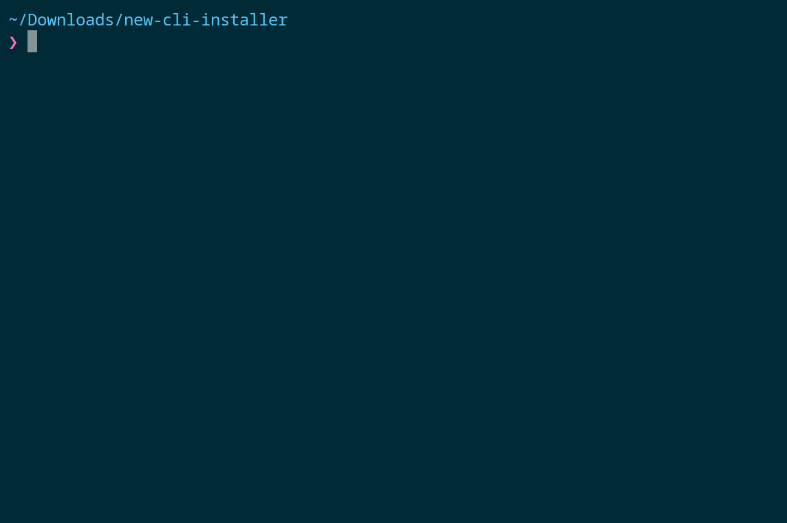

</img>

# cachyos-new-installer
CLI net-installer for CachyOS, inspired by manjaro-architect

This installer provides online installation for CachyOS.

Fast and smooth installer for Arch based operating system.

Requirements
------------
* C++23 feature required (tested with GCC 14.1.1 and Clang 18)
Any compiler which support C++23 standard should work.

######
## Installing from source

This is tested on Arch Linux, but *any* recent Linux with latest C++23 compiler should do:

```sh
sudo pacman -Sy \
    base-devel cmake pkg-config ninja clang mold llvm
```

### Cloning the source code
```sh
git clone https://github.com/cachyos/new-cli-installer.git
cd new-cli-installer
```

### Building and Configuring
#### cmake(recommended):
To build, first, configure it(if you intend to install it globally, you
might also want `-DCMAKE_INSTALL_PREFIX=/usr`):
```sh
cmake -S . -B build
```
Second, build it:
```sh
cmake --build build
```

#### meson:
To build, first, configure it (if you intend to install it globally, you
might also want `--prefix=/usr`):
```sh
meson build
```
Second, compile it:
```sh
meson compile -C build
```

Optionally, to disable developer environment:
pass `-DENABLE_DEVENV=OFF` to cmake or `-Ddevenv=false` to meson when configuring the project.


### Libraries used in this project

* [Functional Terminal (X) User interface](https://github.com/ArthurSonzogni/FTXUI) used for TUI.
* [A modern formatting library](https://github.com/fmtlib/fmt) used for formatting strings, output and logging.
* [Fast C++ logging library](https://github.com/gabime/spdlog) used for logging process of the installer.
* [Parsing gigabytes of JSON per second](https://github.com/simdjson/simdjson) used for config deserialization.
* [Curl for People](https://github.com/libcpr/cpr) used for connection check and maybe in future fetching netinstall config from github.
* [Ranges](https://github.com/ericniebler/range-v3) used for ranges support.


**Simple menu overview:**

TODO: should be simple as Calamares Installer

---

**Advanced menu overview:**

```
Main Menu
|
├── Prepare Installation
|   ├── Set Virtual Console
|   ├── List Devices
|   ├── Partition Disk
|   ├── RAID (WIP)
|   ├── LUKS Encryption
|   ├── Logical Volume Management (WIP)
|   ├── Mount Partitions
|   ├── Configure Installer Mirrorlist
|   |   ├── Edit Pacman Configuration
|   |   └── Rank Mirrors by Speed (TODO)
|   |
│   └── Refresh Pacman Keys
|
├── Install System
│   ├── Install Base Packages
│   ├── Install Desktop
│   ├── Install Bootloader
│   ├── Configure Base
|   │   ├── Generate FSTAB
|   │   ├── Set Hostname
|   │   ├── Set System Locale
|   │   ├── Set Timezone and Clock
|   │   ├── Set Root Password
|   │   └── Add New User(s)
|   │
│   ├── Install Custom Packages
│   ├── System Tweaks
|   │   ├── Enable Automatic Login
|   │   └── Performance
|   |       ├── I/O schedulers
|   |       └── Swap configuration
|   │
│   ├── Review Configuration Files
│   └── Chroot into Installation
|
└── System Rescue
    ├── Install Hardware Drivers
    │   ├── Install Display Drivers
    │   └── Install Network Drivers (TODO)
    |
    ├── Install Bootloader
    ├── Configure Base
    |   └── ... (see 'Install System')
    │
    ├── Install Custom Packages
    ├── Remove Packages
    ├── Review Configuration Files
    ├── Chroot into Installation
    ├── Data Recovery (TODO)
    │   └── Btrfs snapshots..
    │
    └── View System Logs
        ├── Dmesg
        ├── Pacman log
        ├── Xorg log
        └── Journalctl
```
